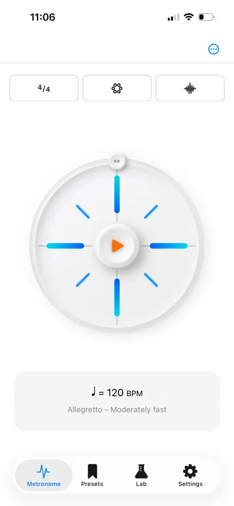

  
  <h1 style="font-size: 3em; margin-bottom: 0.2em; font-weight: 700;">TempoBlocks</h1>
  
Metronome. Code. Play.

  
  <a href="https://apps.apple.com/ua/app/tempoblocks/id6756262722" style="display: inline-block; background: #000; color: #fff; padding: 12px 24px; border-radius: 40px; text-decoration: none; font-weight: bold; font-size: 1.1em; transition: opacity 0.2s;" onmouseover="this.style.opacity='0.8'" onmouseout="this.style.opacity='1'">
    Download on the App Store
  </a>

  

    TempoBlocks is an intuitive metronome that goes beyond keeping time. It combines a clean, friendly interface with a block-based language that lets users build, customise, and explore rhythms through visual programming. Discover an intuitive, hands-on metronome powered by customisable blocks—see, shape, and program rhythms in seconds!
  

  <h2 style="margin-top: 40px; margin-bottom: 20px; font-weight: 600;">Key Features</h2>
  <ul style="list-style-type: none; padding: 0;">
    <li style="margin-bottom: 15px; padding-left: 20px; border-left: 3px solid #007aff;">
      <strong>Elegant bar wheel</strong> that shows timing and beat strength at a glance
    </li>
    <li style="margin-bottom: 15px; padding-left: 20px; border-left: 3px solid #5856d6;">
      <strong>Simple, direct controls</strong> for effortless tempo settings
    </li>
    <li style="margin-bottom: 15px; padding-left: 20px; border-left: 3px solid #ff2d55;">
      <strong>Engaging sound sets</strong> and useful presets for quick setup
    </li>
    <li style="margin-bottom: 15px; padding-left: 20px; border-left: 3px solid #ff9500;">
      <strong>Accurate timing</strong> powered by a high-quality audio engine
    </li>
    <li style="margin-bottom: 15px; padding-left: 20px; border-left: 3px solid #ffcc00;">
      <strong>Visual cues</strong> to help learners understand beat patterns and accents
    </li>
    <li style="margin-bottom: 15px; padding-left: 20px; border-left: 3px solid #4cd964;">
      <strong>Custom rhythm creation</strong> using a visual domain-specific language ('Tempo blocks')
    </li>
    <li style="margin-bottom: 15px; padding-left: 20px; border-left: 3px solid #5ac8fa;">
      <strong>Support for common time signatures</strong>, accents, subdivisions, and gradual tempo changes
    </li>
    <li style="margin-bottom: 15px; padding-left: 20px; border-left: 3px solid #8e8e93;">
      <strong>Ad-free and account-free</strong> environment for safe, distraction-free learning
    </li>
  </ul>

  <h2 style="text-align: center; margin-bottom: 30px; font-family: -apple-system, BlinkMacSystemFont, 'Segoe UI', Roboto, Helvetica, Arial, sans-serif;">Screenshots</h2>
  

    
    
    
    
    
    
  

